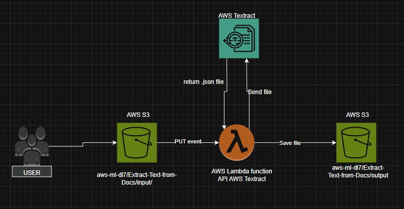

# 🧾 AWS - Extract Text from Documents

This project uses **Amazon Textract**, **AWS Lambda**, and **Amazon S3** to automatically extract text from uploaded documents and store the results in a structured format.

---

## 1️⃣ IAM Role Configuration

To run the Lambda function, create a new IAM role.

### 🔧 Steps:
1. Go to the **IAM console**.
2. Create a new role, e.g., `lambda-textract-s3-access`.
3. Attach the following policies:
   - `AmazonTextractFullAccess`
   - `AmazonS3FullAccess`
   - `AWSLambda_FullAccess`
   - `AWSLambdaBasicExecutionRole`

---

## 2️⃣ S3 Bucket Setup

Create a new S3 bucket with a globally unique name.

### 📁 Folder Structure:
- Extract-Text-from-Docs/input/
- Extract-Text-from-Docs/output/

---

## 3️⃣ Lambda Layer Setup

1. Go to the **Lambda** service in the AWS Console.  
2. Click **Create layer**  
3. **Name**: `textract-trp-layer`  
4. Upload your `.zip` layer file (containing additional libraries or modules)  
5. **Compatible runtimes**: `Python 3.13` (or choose as needed)  
6. Click **Save**

---

## 4️⃣ Lambda Function Setup

1. Go to the **Lambda** service.
2. Click **Create function**.
3. **Runtime**: `Python 3.12`  
4. **Permissions**: Use existing role `lambda-textract-s3-access`.

### 🧾 Code Deployment
Paste the content of your `lambda_function.py` in the **Code Source** section.

### 🔧 Runtime Settings
1. Scroll to **Runtime settings**
2. Click **Edit**
3. Set **Handler** to:
4. Click **Save**

---

## 5️⃣ Add S3 Trigger

1. At the top of the Lambda function page, click **+ Add trigger**.
2. Choose **S3** as the source.
3. Select your bucket.
4. Set:
- **Prefix**: `Extract-Text-from-Docs/input/`
- **Event Type**: `PUT`
5. Click **Save**

---

## ✅ Done!

Your AWS-powered text extraction pipeline is now ready to process incoming documents automatically.

---

